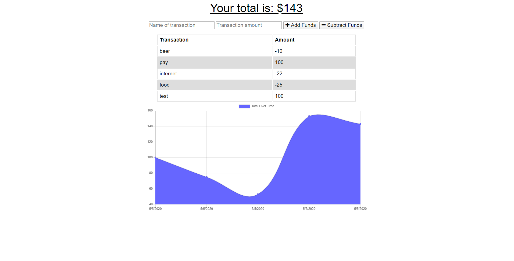

# budget-tracker

## Description
This project is used to to have a working website that shows the your budget. You can adjust it on and offline.

This project is deployed at https://damp-shore-49172.herokuapp.com/

---

## Table of Contents
*[Description](#description)

*[Installation](#installation)

*[GitHub](#github)

---

## Installation
The user will need to init and npm i to install the dependencies of compression, express, lite-server, mongoose, and morgan.

---

## Usage for My Project
The use of this project is to make it fast and easy for users to create and keep track of their money with this budget tool. While offline we use IndexedDB to store the data locally in the browser and when the user goes back online the data is pushed to the mongo database and the budget tool is updated.

---

## Contributors and Help
Louis Coleman

---

## Tests
There are no tests for this project

---

## GitHub

https://github.com/coleloui

No user email

---
                    
                    